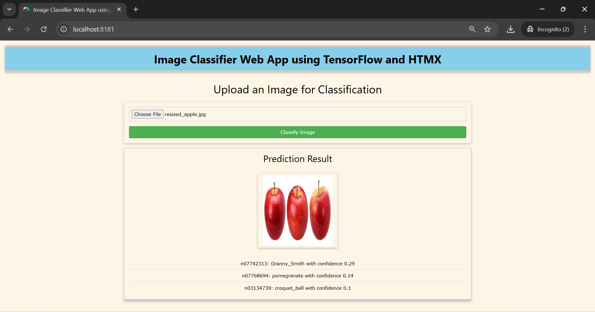

# Image Classification with TensorFlow and MobileNetV2

This project demonstrates how to build a web-based **image classification** application using **TensorFlow** and the pre-trained **MobileNetV2** model. Users can upload an image, and the app will classify it, providing the top 3 predicted labels along with their confidence scores.

---

## 🚀 **Project Overview**

- **Goal**: To build an image classification system that allows users to upload an image and receive predictions on what objects are in the image.
- **Model Used**: **MobileNetV2**, a pre-trained Convolutional Neural Network (CNN) model, fine-tuned on the **ImageNet** dataset, which contains 1,000 different object categories.
- **Technologies**:
  - **Python**
  - **TensorFlow** and **Keras**
  - **Flask** (for the web app)
  - **W3.CSS** (for frontend styling)

---

## 💡 **Features**

- **Image Upload**: Allows users to upload an image via the web interface.
- **Image Classification**: Classifies the image using the MobileNetV2 model, returning the top 3 predicted labels and their confidence scores.
- **Dynamic Results**: Results are displayed dynamically without reloading the page.
- **User-Friendly Interface**: Simple, clean design using **W3.CSS** for styling and responsiveness.

---

## 🛠️ **Technologies Used**

- **TensorFlow**: The framework used to load and run the pre-trained MobileNetV2 model.
- **Keras**: For image preprocessing and model prediction.
- **Flask**: Web framework for building the application.
- **W3.CSS**: For building a responsive front-end.
- **HTML/CSS**: For structure and styling of the web pages.

---

## 🎯 **How It Works**

1. **Image Upload**: The user selects an image from their local machine and uploads it via the form.
2. **Preprocessing**: The uploaded image is resized and converted into a format that can be fed into the MobileNetV2 model.
3. **Model Prediction**: The pre-trained MobileNetV2 model processes the image and returns a list of predictions with corresponding confidence scores.
4. **Displaying Results**: The top 3 predictions are shown dynamically on the results page with their respective confidence scores.

---

## 🚀 **Installation & Setup**

Follow the steps below to set up and run the project locally:

### 1. **Clone the Repository**

```bash
git clone https://github.com/jeetendra29gupta/image-classification-flask-tensorflow.git
cd image-classification-flask-tensorflow
```

### 2. **Create a Virtual Environment (optional but recommended)**

This ensures that your dependencies do not interfere with other Python projects:

```bash
python -m venv venv
source venv/bin/activate  # On Windows use `venv\Scripts\activate`
```

### 3. **Install the Required Dependencies**

Install all the necessary Python libraries by running:

```bash
pip install -r requirements.txt
```

If you don’t have the `requirements.txt` file, you can manually install the dependencies:

```bash
pip install Flask tensorflow numpy pillow
```

### 4. **Run the Flask Application**

Once everything is installed, run the Flask app with:

```bash
python app.py
```

### 5. **Open in Browser**

Open your browser and navigate to [http://127.0.0.1:8181/](http://127.0.0.1:8181/) to interact with the application.

---

## 📸 **How to Use the Application**

1. **Upload an Image**:
   - Go to the home page and click on the **"Choose File"** button.
   - Select an image file from your local machine (JPG, PNG, or JPEG).
   
2. **View the Results**:
   - Once the image is uploaded, the app will classify it and display the top 3 predicted labels along with their confidence scores.
   - The prediction is displayed dynamically on the same page.

---

## 🤖 **Example Outputs**

- **Example 1**:  
  **Image**: An image of an apple.  
  **Predictions**:
  - **Apple** with 90% confidence.
  - **Orange** with 5% confidence.
  - **Lemon** with 3% confidence.

- **Example 2**:  
  **Image**: A picture of a dog.  
  **Predictions**:
  - **Golden Retriever** with 80% confidence.
  - **Labrador** with 10% confidence.
  - **Poodle** with 5% confidence.

---

## ⚙️ **Code Structure**

```
image-classification-flask-tensorflow/
├── main_app.py                  # Flask application script
├── requirements.txt        # Python dependencies
├── templates/
│   ├── index.html          # Main page with file upload form
│   └── result.html         # Result page displaying predictions
├── static/
│   ├── uploads/            # Folder where uploaded images are stored
│   └── style.css           # Custom CSS (if any)
└── README.md               # Project documentation (this file)
```

---

## 📝 **Requirements**

- **Python 3.7+**
- **TensorFlow 2.x**: Ensure you have TensorFlow 2.x installed for the MobileNetV2 model.
- **Flask**: For creating the web interface.
- **Pillow**: For image processing (loading and resizing images).
- **W3.CSS**: For responsive front-end styling.

---

## 🔧 **Known Issues & Future Improvements**

- **Accuracy**: The pre-trained MobileNetV2 model is trained on a general-purpose dataset (ImageNet), which may not always return highly accurate results for specific objects like fruits. Fine-tuning the model on a custom dataset can improve classification accuracy for domain-specific tasks.
- **Error Handling**: Add more comprehensive error handling for edge cases like unsupported file types or very large images.
- **Performance**: The current version may be slow for large images or when running multiple requests concurrently. Optimizations like batching predictions could help.

---

## 📣 **Contributing**

Feel free to fork the repository, make improvements, or report issues by opening a pull request or creating an issue. Contributions are welcome!

---
